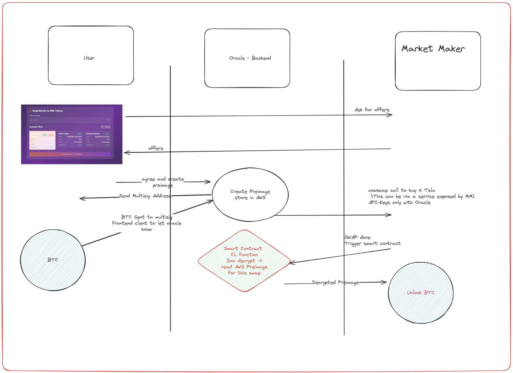

# Takefi - Bitcoin Cross-Chain Oracle for RWA Token Swaps

## Overview

This project implements a trustless cross-chain swap mechanism that allows users to exchange Bitcoin (BTC) for Real-World Asset (RWA) tokens on Avalanche while keeping their BTC native on the Bitcoin blockchain. The system uses Hash Time-Locked Contracts (HTLCs), Chainlink oracles, and market maker liquidity to create secure, atomic swaps without requiring wrapped tokens or custodial solutions.

We utilized existing RWA tokens on Avalanche using backed.fi assets. This project shows how we can leverage HTLC's to bring liquidity from Bitcoin to Avalanche without the need for wrapped tokens, thus avoiding minting and burning fees.

## Sponsors used - 
#### Chainlink Functions
We were able to use chainlink function as the glue to make this cross chain RWA swap possible.

https://functions.chain.link/avalanche/38
Relevant Files - 
cow-mm-server/preimage-retrieval.js
cow-mm-server/getPreimageAndRedeem.js
chainlink-functions/contracts/FunctionsConsumer.sol

#### Avalanche
https://snowtrace.io/tx/0x1305b509274ab13e948baeb74e5f2391e8575c4fcc948a63012bbeecc0955fdf
https://snowtrace.io/address/0x810a52Bbd315C5B493fdd417b3f8b36e23226324 --> Contract deployed on Avalanche for functions consumer

#### AWS
We utilized AWS Secrets Manager to securely store and manage sensitive data such as preimages used in the HTLCs.
oracle-backend/src/controllers/oracleController.js

## Architecture

## RPC
https://bitcoin-rpc.publicnode.com

## Swap Flow
The swap flow can be illustrated as follows:

The system consists of three main actors working together:

### 🧑‍💻 **User**
- Holds Bitcoin and wants to swap for RWA tokens (e.g., XCOINB)
- Locks BTC in a Bitcoin script with timelock protection
- Receives RWA tokens on Ethereum upon successful swap

### 🏦 **Market Maker (MM)**
- Provides liquidity for both BTC and RWA tokens
- Pre-funds the system to enable instant swaps
- Earns fees from successful transactions
- Takes on inventory and market risk

### 🔮 **Oracle (Chainlink)**
- Generates secure preimages for HTLC scripts
- Monitors both Bitcoin and Ethereum networks
- Triggers atomic swap execution when conditions are met
- Stores sensitive data securely in AWS Secrets Manager

## 🔐 Security Features

### **Hash Time-Locked Contracts (HTLCs)**
- Bitcoin scripts that require a secret (preimage) to unlock
- Built-in timelock protection prevents funds from being permanently locked
- Atomic execution ensures both sides of the swap complete or neither does

### **Oracle-Generated Preimages**
- Cryptographically secure random preimage generation
- Stored encrypted in AWS Secrets Manager
- Released only when swap conditions are verified on-chain

### **Market Maker Bonds**
- MMs post collateral to guarantee swap execution
- Economic incentives prevent malicious behavior
- Slashing mechanisms for failed deliveries

## 🛠️ Technology Stack

### **Backend Oracle**
- **Node.js + Express**: RESTful API server
- **bitcoinjs-lib**: Bitcoin script generation and transaction handling
- **AWS Secrets Manager**: Secure preimage storage and retrieval
- **Chainlink Functions**: Cross-chain verification and automation

### **Frontend Interface**
- **React + Tailwind CSS**: Modern, responsive user interface
- **Real-time updates**: Live swap progress tracking
- **Market maker aggregation**: Compare offers from multiple liquidity providers

### **Smart Contracts**
- **Ethereum/Solidity**: RWA token management and escrow
- **Chainlink integration**: Oracle data feeds and automation
- **Multi-signature security**: Protected fund management

## 🎯 Key Benefits

- **🔒 Non-Custodial**: Users maintain control of their Bitcoin
- **⚡ Fast Settlement**: Market maker liquidity enables instant swaps
- **🌐 Cross-Chain**: Native Bitcoin to Ethereum asset swaps
- **🛡️ Trustless**: Smart contracts and cryptographic proofs
- **💰 Cost Effective**: No wrapped token minting/burning fees
- **📈 Scalable**: Support for multiple RWA token types

## 📄 License

This project is licensed under the MIT License

---

> **⚠️ Disclaimer**: This software is experimental and under active development. Do not use with real funds on mainnet without thorough testing and security audits.