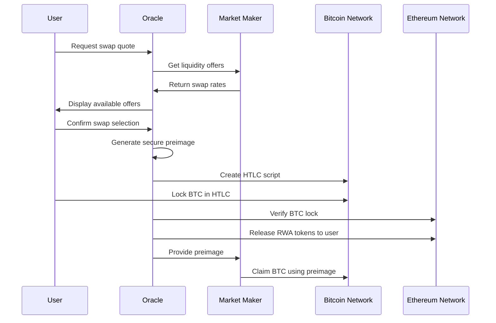

# Takefi - Bitcoin Cross-Chain Oracle for RWA Token Swaps

## 🚀 Overview

This project implements a trustless cross-chain swap mechanism that allows users to exchange Bitcoin (BTC) for Real-World Asset (RWA) tokens on Ethereum while keeping their BTC native on the Bitcoin blockchain. The system uses Hash Time-Locked Contracts (HTLCs), Chainlink oracles, and market maker liquidity to create secure, atomic swaps without requiring wrapped tokens or custodial solutions.

## 🏗️ Architecture

The system consists of three main actors working together:

### 🧑‍💻 **User**
- Holds Bitcoin and wants to swap for RWA tokens (e.g., XCOINB)
- Locks BTC in a Bitcoin script with timelock protection
- Receives RWA tokens on Ethereum upon successful swap

### 🏦 **Market Maker (MM)**
- Provides liquidity for both BTC and RWA tokens
- Pre-funds the system to enable instant swaps
- Earns fees from successful transactions
- Takes on inventory and market risk

### 🔮 **Oracle (Chainlink)**
- Generates secure preimages for HTLC scripts
- Monitors both Bitcoin and Ethereum networks
- Triggers atomic swap execution when conditions are met
- Stores sensitive data securely in AWS Secrets Manager

## RPC
https://bitcoin-rpc.publicnode.com

## 🔄 Swap Flow



## 🔐 Security Features

### **Hash Time-Locked Contracts (HTLCs)**
- Bitcoin scripts that require a secret (preimage) to unlock
- Built-in timelock protection prevents funds from being permanently locked
- Atomic execution ensures both sides of the swap complete or neither does

### **Oracle-Generated Preimages**
- Cryptographically secure random preimage generation
- Stored encrypted in AWS Secrets Manager
- Released only when swap conditions are verified on-chain

### **Market Maker Bonds**
- MMs post collateral to guarantee swap execution
- Economic incentives prevent malicious behavior
- Slashing mechanisms for failed deliveries

## 🛠️ Technology Stack

### **Backend Oracle**
- **Node.js + Express**: RESTful API server
- **bitcoinjs-lib**: Bitcoin script generation and transaction handling
- **AWS Secrets Manager**: Secure preimage storage and retrieval
- **Chainlink Functions**: Cross-chain verification and automation

### **Frontend Interface**
- **React + Tailwind CSS**: Modern, responsive user interface
- **Real-time updates**: Live swap progress tracking
- **Market maker aggregation**: Compare offers from multiple liquidity providers

### **Smart Contracts**
- **Ethereum/Solidity**: RWA token management and escrow
- **Chainlink integration**: Oracle data feeds and automation
- **Multi-signature security**: Protected fund management

## 🎯 Key Benefits

- **🔒 Non-Custodial**: Users maintain control of their Bitcoin
- **⚡ Fast Settlement**: Market maker liquidity enables instant swaps
- **🌐 Cross-Chain**: Native Bitcoin to Ethereum asset swaps
- **🛡️ Trustless**: Smart contracts and cryptographic proofs
- **💰 Cost Effective**: No wrapped token minting/burning fees
- **📈 Scalable**: Support for multiple RWA token types

## 🚧 Development Status

This project is currently in active development. The initial phase focuses on:

1. ✅ **Oracle Backend**: Preimage generation and Bitcoin script creation
2. 🔄 **Frontend Interface**: User-friendly swap interface
3. 🔄 **Smart Contracts**: Ethereum-side token management
4. 📋 **Integration**: Chainlink Functions and AWS Secrets Manager
5. 🧪 **Testing**: Regtest and testnet deployment

## 🔧 Quick Start

### Prerequisites
- Bitcoin Core (regtest mode)
- Node.js 18+
- AWS Account (for Secrets Manager)
- Ethereum development environment

### Bitcoin Core Setup
```powershell
# Create unencrypted descriptor wallet for development
bitcoin-cli -regtest createwallet "mmm_desc" false false "" false false true

# Generate and fund addresses
$MM_ADDRESS = bitcoin-cli -regtest -rpcwallet=mmm_desc getnewaddress
bitcoin-cli -regtest generatetoaddress 101 $MM_ADDRESS
```

### Oracle Backend
```bash
# Clone repository
git clone <repository-url>
cd bitcoin-oracle-backend

# Install dependencies
npm install

# Configure environment
cp .env.example .env

# Start development server
npm run dev
```

## 📋 Roadmap

- [ ] **Phase 1**: Core oracle functionality and Bitcoin integration
- [ ] **Phase 2**: Ethereum smart contracts and Chainlink integration  
- [ ] **Phase 3**: Frontend interface and user experience
- [ ] **Phase 4**: Market maker onboarding and liquidity
- [ ] **Phase 5**: Mainnet deployment and security audits

## 🤝 Contributing

We welcome contributions from the Bitcoin and DeFi communities! Please see our [Contributing Guidelines](CONTRIBUTING.md) for details on how to get involved.

## 📄 License

This project is licensed under the MIT License

---

> **⚠️ Disclaimer**: This software is experimental and under active development. Do not use with real funds on mainnet without thorough testing and security audits.